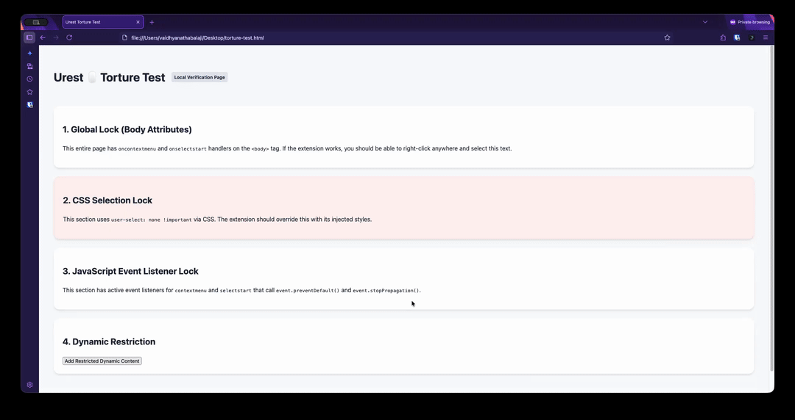

<div align="center">
  
  <h1>Urest</h1>
  <p align="center">
    <strong>Restore right-click, copy, and text selection on any website. Instantly.</strong>
  </p>

  <p align="center">
    <a href="https://addons.mozilla.org/en-GB/firefox/addon/urest-unblock-surgical/"></a>
    <a href="#"></a>
    <a href="https://microsoftedge.microsoft.com/addons/detail/urest-universal-restora/mnhpkflbfhioacjokncnahclmdfndcln"></a>
  </p>

  <p align="center">
    
    
    
  </p>

  <br />

  

  <p><i>Works on Google Docs, Notion, Figma, and every modern web app — without breaking them.</i></p>
</div>

---

## 🚀 The Freedom Restoration

| 🛑 The Problem | ✅ The Fix |
| :--- | :--- |
| **Sites that block right-click**, text selection, and copy-paste. | **URest surgically unblocks** only what's restricting you. |
| News sites. Image galleries. Documentation pages. | Leaves every legitimate web app **fully functional**. |
| Academic journals. Secure portals. | Restore your native browser experience **instantly**. |

---

## ✨ Why Urest?

- **🎯 Smart Unblocking**: Neutralizes restrictions without interfering with a site's actual features.
- **🏗️ Works With Complex Sites**: Built for modern web editors like **Google Docs, VS Code, and Salesforce**.
- **👻 Invisible to Websites**: Operates without leaving detectable footprints or triggering "extension detected" warnings.
- **⚡ No Performance Impact**: High-performance engine that handles dynamic content updates with zero lag.
- **🔒 Private by Design**: Zero tracking. No data collection. 100% local execution within your browser.

---

## ✅ Works Where Others Fail

Urest is battle-tested on the world's most complex web applications:

| Application | Status |
| :--- | :--- |
| **Google Docs** | ✓ Supported |
| **Notion** | ✓ Supported |
| **Figma** | ✓ Supported |
| **VS Code Web** | ✓ Supported |
| **Salesforce** | ✓ Supported |
| **Any site** | ✓ Supported |

---

## 🛠️ Need Support?

Have a question or found a bug? 
- Open an issue on **[GitHub Issues](https://github.com/aankda/urest/issues)**
- Or email us at **[helloaankda@gmail.com](mailto:helloaankda@gmail.com)**

---

<details>
<summary><b>👨‍💻 For Developers</b></summary>

### Architecture Overview
Urest uses a **Dual-World Injection Strategy** to bypass modern fingerprinting:
1. **MAIN World**: A neutralizer script intercepts native browser event cycles and locks the `preventDefault` API.
2. **ISOLATED World**: A manager script coordinates configuration and cleanses the DOM via a high-performance `MutationObserver`.

### Build System
```bash
# Package extensions for Edge & Firefox
npm run package
```
</details>

---

## 📜 Licensing

URest is source-available under the **Urest Proprietary License** by AANKDA LLC.
- **Personal use** is free. 
- **Commercial use** requires a license — contact **helloaankda@gmail.com**.

<div align="center">
  <p>
    Maintained with ❤️ by <strong>AANKDA LLC</strong>.
    <br>
    <strong>Privacy focused. Local-first.</strong>
  </p>
</div>
