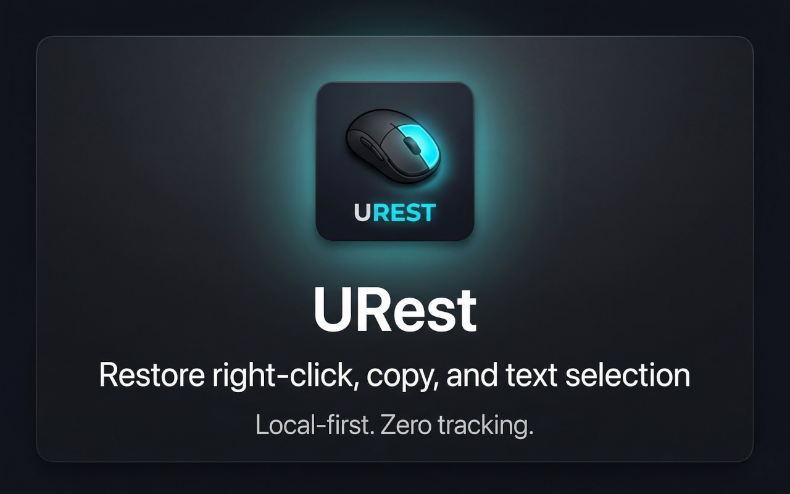
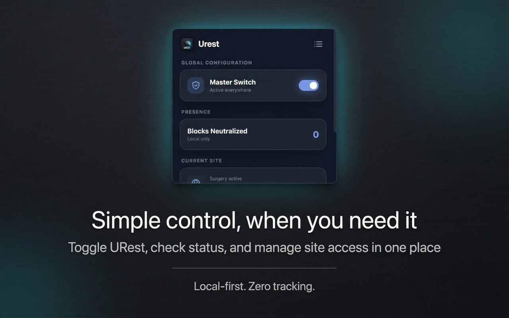
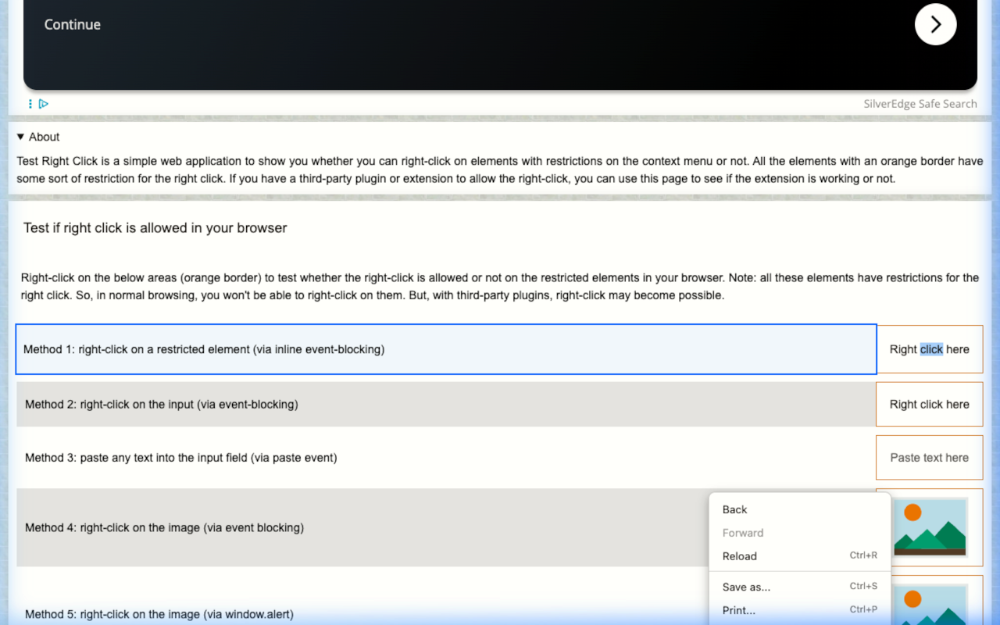

<div align="center">
  
  <h1>URest</h1>
  <p><strong>Restore right-click, copy, and text selection - locally, with zero tracking.</strong></p>

  <p>
    <a href="https://addons.mozilla.org/en-US/firefox/addon/urest/"></a>
    <a href="https://chromewebstore.google.com/detail/urest/cjhpdhipbocaogbgohhagdkjhmfdngoc?hl=en"></a>
    
  </p>

  <br />

  
</div>

---

## Store Preview
<p align="center">
  
  
  
</p>

## What It Does
URest restores native browser controls on sites that block right-click, copy, or text selection, while aiming to keep page behavior intact.

## Why It Matters
- Local-only execution. No telemetry, no outbound requests.
- Minimal interference. Targets restrictive handlers instead of breaking sites.
- User control. Toggle per site from the popup or context menu.

## Key Features
- Neutralizes restrictive `preventDefault` handlers that block selection and context menus.
- Local stats counter for visibility (stored on-device).
- Per-site toggle via popup and context menu.
- Lightweight design focused on performance and reliability.

## Compatibility
Tested on Notion, Salesforce, Google Docs, Figma, and Wikipedia. Best-effort on most sites.

## Privacy
No data collection. Local storage only for preferences and counters. Read the privacy policy at `https://aankda.github.io/urest/privacy.html`.

## Public Site
The public URest landing page and privacy page are maintained centrally in the `aankda.github.io` repository at `https://aankda.github.io/urest/`.

## Support
Have a question or found a bug?
- Open an issue: https://github.com/aankda/urest/issues
- Email: helloaankda@gmail.com
- Verification page: https://aankda.github.io/urest/verification.html

## Third-Party Notices
See `THIRD_PARTY_NOTICES.md` for MIT and OFL attributions used in the project.

<details>
<summary><b>For Developers</b></summary>

### Architecture Overview
URest uses a dual-world injection approach:
1. MAIN world: neutralizes restrictive handlers, including `preventDefault`.
2. ISOLATED world: coordinates configuration and DOM updates via `MutationObserver`.

### Build System
```bash
# Package extensions for Edge and Firefox
npm run package
```
</details>

---

## Licensing
URest is source-available under the URest Proprietary License by AANKDA LLC.
- Personal use is free.
- Commercial use requires a license - contact helloaankda@gmail.com.

<div align="center">
  <p>
    Maintained by <strong>AANKDA LLC</strong>.
    <br>
    <strong>Privacy focused. Local-first.</strong>
  </p>
</div>
